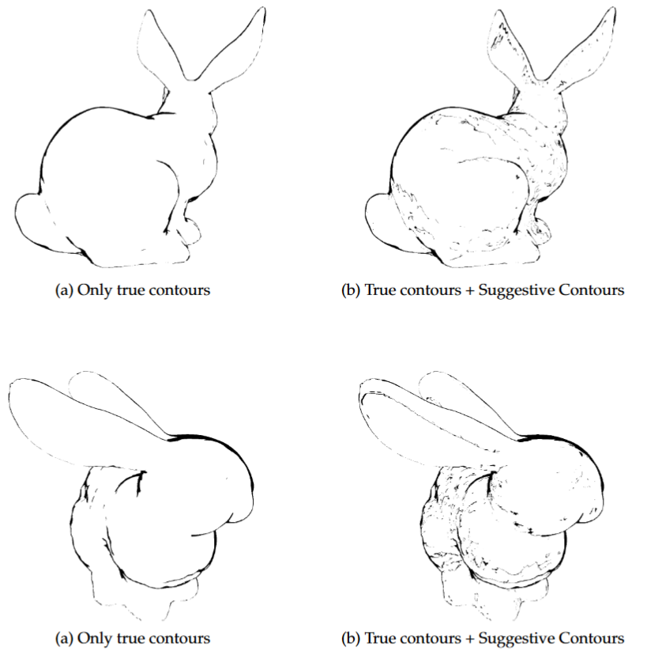

# IGR202 Project - Suggestive Contours

Implementation of the paper => [https://gfx.cs.princeton.edu/pubs/DeCarlo_2003_SCF/DeCarlo2003.pdf](https://gfx.cs.princeton.edu/pubs/DeCarlo_2003_SCF/DeCarlo2003.pdf)

## Build with cmake

`
cmake -B .
`

`
cmake --build . --config Release
`

## Run the program

### Windows
`
.\build\Release\suggestive_contours.exe
`

## User interface

- Rotate view with the middle mouse button
- The *max Kn* button defines the "almost zero radial curvature" value 